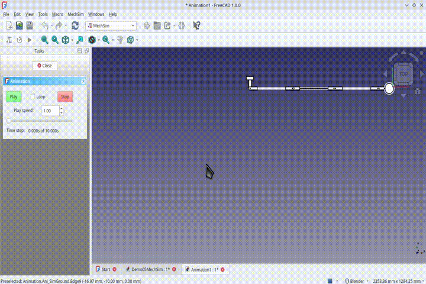

# <em><b>PlanarMechSim</em>
# <h2>A Planar Mechanical Simulator Workbench for FreeCAD&nbsp;1.x</h2>
# <h3>Calculation and Simulation of the Dynamics of Planar Multibody Mechanical Systems</h3>

# <h3>[Previously "NikraDAP" for FreeCAD 0.x]</h3>

The **PlanarMechSim* FreeCAD WorkBench is a planar multibody dynamics workbench that is based on the DAP solver algorithm developed by P.E.&nbsp;Nikravesh  (**PLANAR MULTIBODY DYNAMICS: Formulation, Programming with MATLAB, and Applications**, 2nd Edition, *P.E.&nbsp;Nikravesh*, CRC&nbsp;Press, 2018)  
  

# <h3>There are draft tutorials available for <em>PlanarMechSim</em> on YouTube:</h3>

https://youtube.com/@CecilChurmsBrightSparks 

  

<em>Please be patient:  The software and documentation is still in the process of development.</em>

# ---------------------------------------

Cecil Churms, 
Johannesburg, 
South Africa.  

Last updated: 28th April 2025 

